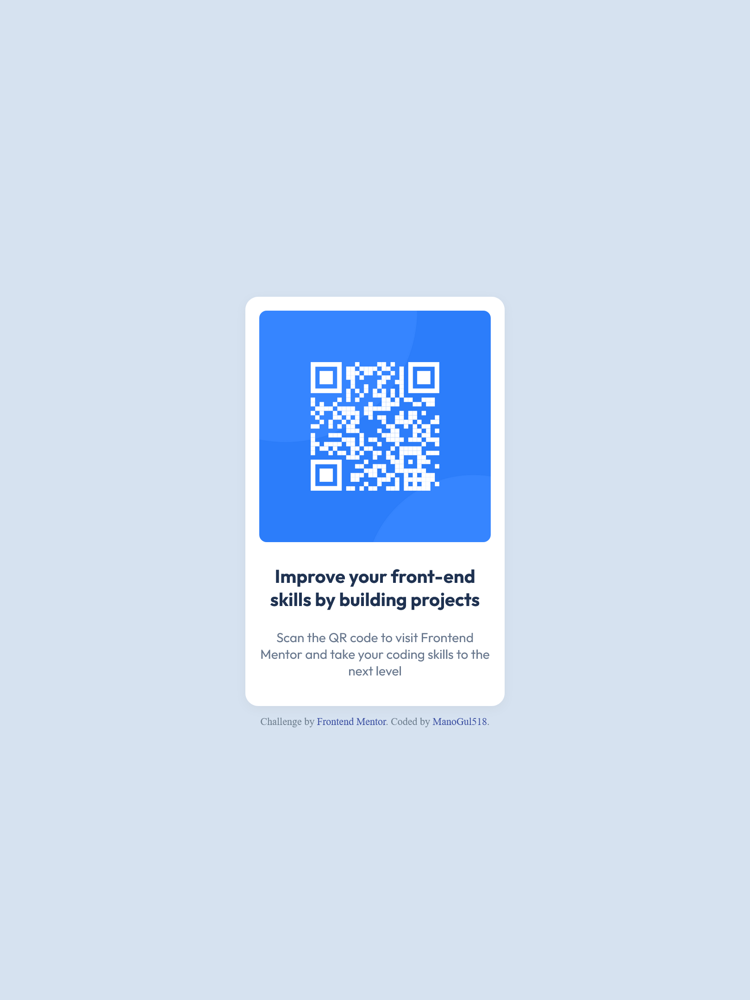

# Frontend Mentor - QR code component solution

This is a solution to the [QR code component challenge on Frontend Mentor](https://www.frontendmentor.io/challenges/qr-code-component-iux_sIO_H). Frontend Mentor challenges help you improve your coding skills by building realistic projects. 

## Table of contents

- [Overview](#overview)
  - [Screenshot](#screenshot)
  - [Links](#links)
- [My process](#my-process)
  - [Built with](#built-with)
  - [What I learned](#what-i-learned)
  - [Continued development](#continued-development)
- [Author](#author)

## Overview

### Screenshot

### Links

- Solution URL: [Add solution URL here](https://your-solution-url.com)
- Live Site URL: (https://manogul518.github.io/FrontendMentor-QR-Code-Challenge-/)

## My process

### Built with

- Semantic HTML5 markup
- CSS custom properties
- Flexbox

### What I learned

By building this project, I learned how to style basic cards like this QR Code card. It helped me level up my design skills as well as my coding skills.

### Continued development

I think I want to continue taking on challenges like this to improve my overall coding skills. Until I finally feel confident enough, i will continue challenging myself :).

### Useful resources

- [Youtube - Code With Harry](https://www.youtube.com/@CodeWithHarry) - I used to learn from this channel in my starting days. Most specifically, the "Sigma Web Development Series" playlist.
- [MDN Web Docs](https://webdocs.dev/en-us/docs/mdn) - Whenever I was confused about any tags or properties, I'd go to this site for quickly understanding the code.

## Author

- Frontend Mentor - [@ManoGul518](https://www.frontendmentor.io/profile/ManoGul518)
- GitHub - [@ManoGul518](https://github.com/ManoGul518)

